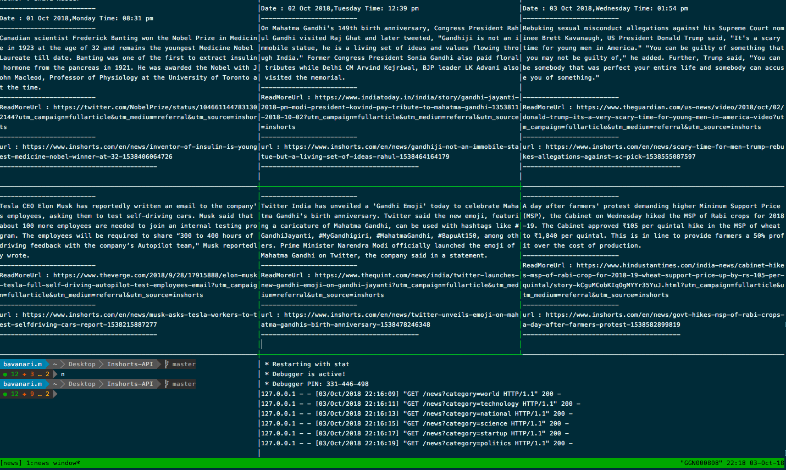

# NewsOnTerminal

Simple Python script to bring news directly to your terminal

## Installation and Setup

All dependencies are listed in *requirements.txt* file. 
if you are virtualenv wrapper , workon virtualenv and then run these commands

1. clone the repo
2. cd into the repo
3. workon yourfavvirtualenv
4. To install all dependencies run - 

    ```bash
    $ sudo pip freeze -r requirements.txt
    ```

5. Start the api server

    ```bash 
    $ python app.py 
    ```
6. to refresh news 

    ```bash 
    $ python news_display.py 
    ```
7. to refresh automatically at regular intervals 
    ```bash 
    $ python news_crons.py 
    ```
news will be written to `category.txt` ex: national.txt

- You can awesomify the same by using tmux or screen 
- you can automate the awesomification by using tmuxp
- For more categories read api_readme.md file

